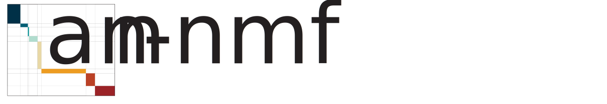

# 

[](https://pypi.python.org/pypi/ann_nmf/)
[](https://badge.fury.io/py/ann_nmf)
[](https://github.com/psf/black)

AnnData wrapper of the [**ARD-NMF module**](https://github.com/broadinstitute/SignatureAnalyzer-GPU/blob/master/ARD_NMF.py) from [**SignatureAnalyzer-GPU**](https://github.com/broadinstitute/SignatureAnalyzer-GPU).

## Installation

Install using [pip](https://pypi.org/project/ann-nmf/)
```BASH
pip install ann_nmf
```

Alternatively, install the development version:
```BASH
git clone https://github.com/mvinyard/ann_nmf.git; cd ann_nmf;
pip install -e .
```

## API overview

#### Import libraries and get some data
```python
import ann_nmf
import scanpy as sc

adata = sc.datasets.pbmc3k()
ann_nmf.ut.preprocess_raw_counts(adata)
```

#### Key class:
```python
nmf = ann_nmf.NMF(adata, outdir="nmf_results/pbmc3k") # saves .h5 file
nmf.run(n_runs=10, K0=20, max_iter=2000)
```

#### SignatureAnalyzer visualization:
```python
nmf.cluster()
nmf.signatures()
```
<a></a><a></a>

```python
nmf.plot_umap_signatures(adata)
```


```python
ann_nmf.ut.fetch_signature(nmf.nmf_genes, 1)
```


## Conceptual background and foundational work

* ARD-NMF theory [Arxiv](https://arxiv.org/pdf/1111.6085.pdf)
* SignatureAnalyzer ([GitHub](https://github.com/getzlab/getzlab-SignatureAnalyzer))
* SignatureAnalyzer-GPU ([GitHub](https://github.com/broadinstitute/SignatureAnalyzer-GPU))

## Acknowledgements

* Most of the code to wrap SignatureAnalyzer in an AnnData-friendly API was borrowed directly (and shamelessly) from **Shankara Anand** (**[@shankara-a](https://github.com/shankara-a)**) with only slight refactoring for more flexibility with fewer dependencies on install.
